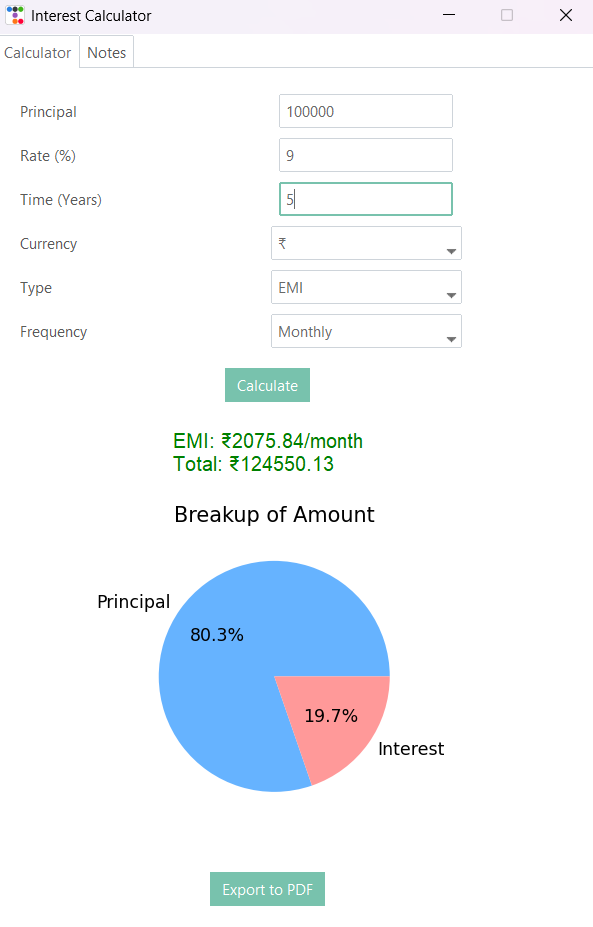

# Interest Calculator

A user-friendly desktop application built with Python, `tkinter`, and `ttkbootstrap` to calculate simple interest, compound interest, and Equated Monthly Installments (EMI). The application provides a clean interface, visualizes results with charts, and allows exporting calculations to PDF.



## Features

- **Multiple Calculation Modes**:
  - Simple Interest
  - Compound Interest
  - Equated Monthly Installment (EMI)
- **Customizable Inputs**:
  - Principal Amount
  - Interest Rate (%)
  - Time (in years/months)
  - Currency Symbol (₹, $, €, £)
  - Compounding Frequency (Annually, Semi-Annually, Quarterly, Monthly)
- **Clear Results**:
  - Displays a clear breakdown of the principal amount and total interest.
  - Generates a pie chart using `matplotlib` to visualize the principal vs. interest breakup.
- **PDF Export**:
  - Export the calculation results and the accompanying chart into a well-formatted PDF document using `reportlab`.
- **Financial Notes**:
  - A "Notes" tab provides recommended interest rates, durations, and remarks for various financial categories like Fixed Deposits (FD), Savings, Home Loans, etc.
- **User-Friendly Interface**:
  - A tabbed layout using `ttk.Notebook` for easy navigation between different calculators and notes.
  - Includes input validation and error handling to prevent incorrect data entry.

## Technologies Used

- **Python 3**: Core programming language.
- **tkinter / ttkbootstrap**: For the graphical user interface (GUI). `ttkbootstrap` provides modern themes for `tkinter`.
- **matplotlib**: For creating charts and visualizations.
- **reportlab**: For generating and exporting PDF files.
- **PIL (Pillow)**: For handling images within the application.

## Installation

1. **Clone the repository**:
   ```bash
   git clone https://github.com/your-username/interest-calculator.git
   cd interest-calculator
   ```

2. **Install dependencies**:
   Make sure you have Python 3 installed. You can install the required packages using pip:
   ```bash
   pip install -r requirements.txt
   ```
   *Note: If a `requirements.txt` file is not available, you can install the packages individually:*
   ```bash
   pip install ttkbootstrap matplotlib reportlab pillow
   ```

## Usage

1. **Run the application**:
   ```bash
   python main.py
   ```
   *(Assuming the main script is named `main.py`)*

2. **Select the calculation type**:
   - Use the tabs to switch between "Simple Interest", "Compound Interest", and "EMI Calculator".

3. **Enter the required details**:
   - Fill in the fields for principal, rate, time, etc.
   - Select a currency symbol and compounding frequency where applicable.

4. **Calculate**:
   - Click the "Calculate" button to see the results.

5. **View Chart and Export**:
   - A pie chart will be displayed showing the principal and interest amounts.
   - Click the "Export to PDF" button to save the results and chart as a PDF file.

6. **Check Notes**:
   - Navigate to the "Notes" tab to view recommendations for different financial products.

## Acknowledgements

- **ttkbootstrap**: For providing the modern themes and styles for the tkinter GUI, making the application look clean and professional.
- **matplotlib**: For the powerful and flexible charting library that allows for easy visualization of financial data.
